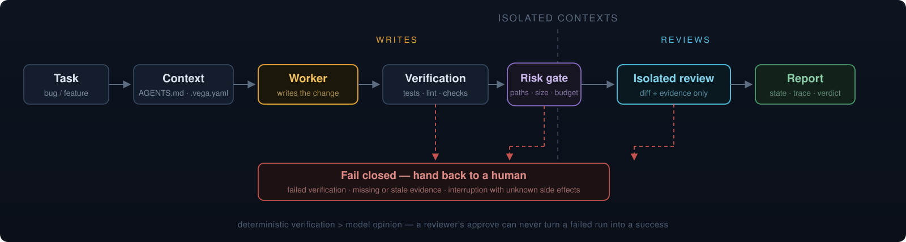

<div align="center">


# Vega

<h3>AI 编码 Supervisor Agent 与验证 Harness</h3>

<p><strong>One writes, one reviews.</strong></p>

<p>
  <a href="https://github.com/aki0225/vegaloom/actions/workflows/ci.yml"></a>
  
  
  <a href="LICENSE"></a>
</p>

**[在线展示](https://aki0225.github.io/vegaloom/)** ·
**[快速开始](#快速开始)** ·
**[适用场景](#什么时候用-vega)** ·
**[核心设计](#核心设计)** ·
**[Supervisor Agent](#supervisor-agent)** ·
**[文档](#文档)**

</div>

Vega 接在编码 Agent 和代码仓库之间：记录真实 Diff，运行项目验证，并在前置门禁通过且配置
启用时启动独立 Reviewer，再根据证据给出交付状态。Supervisor Agent 为长任务增加人工批准
的变更合同、单 Writer、Git Checkpoint 和恢复控制。

<p align="center">
  
</p>

## 快速开始

要求 Python `>=3.11` 和 Git。自动 Worker 或独立 Reviewer 还需要已经安装并登录 Codex CLI。

```powershell
git clone https://github.com/aki0225/vegaloom.git
cd vegaloom
python -m venv .venv
.\.venv\Scripts\Activate.ps1
python -m pip install -e .
```

任务边界不清楚时，先做只读调查并让人工确认 Plan；边界和验收已经明确时再直接执行。
完整约定见 [Plan-first 与修改前确认协议](docs/PLAN-FIRST-PROTOCOL.md)。

```powershell
vega config check --repo .
vega loop bug --repo . --text "修复导出按钮无响应" --mode assist
vega latest --kind loop
vega loop continue --repo . --run <run_id>
vega finish --run <run_id>
```

`config check` 只检查配置和仓库准备状态，不运行测试。常见 warning 包括项目策略未纳入 Git、
`runs/` 未忽略、Python `src` layout 的导入路径不明确，以及 Windows 行尾策略未固定。

`assist` 要求启动时没有 staged 或 unstaged tracked diff。Vega 先生成并校验
`workspace-baseline.json`，再写出 `worker-prompt.md`。主会话或子代理完成修改后运行
`loop continue`；后续判断以当前工作区和验证证据为准。

| Finish 状态 | 含义 |
|---|---|
| `ready_to_commit` | 验证和审查证据完整，可以开始人工 Diff 检查 |
| `needs_fix` | 验证失败，或 Reviewer 返回 `request_changes`，需要继续修改 |
| `needs_human` | 验证、风险、现场或证据需要人工处理 |
| `incomplete` | 当前运行还没有形成完整的交付结论 |

`request_changes` 是 Reviewer 结论，不是 Finish 状态。

边界清晰的一次性任务可以直接使用自动入口：

```powershell
vega do feature --repo . --text "新增批量导入用户功能"
```

## 什么时候用 Vega

- 希望 AI 修改代码，但交付结果必须由项目测试和实际 Diff 证明。
- 希望 Worker 与 Reviewer 分开，避免同一会话直接给自己的改动背书。
- 只想优先查看高风险文件、Reviewer finding 和验证结果，不想从头阅读整份 Diff。
- 任务会持续较长时间，需要人工批准、状态查看、暂停和 Git-only 恢复。

## Vega 不解决什么

- Vega 不替代 Codex、Claude Code、Cursor 等编码工具。
- 会话隔离不是容器或操作系统级安全沙箱。
- 没有可靠验证命令的项目，Vega 也无法凭空生成可信测试证据。
- 数据库迁移、支付、部署等变更仍需要人工风险判断和真实环境验证。
- Vega 不操作用户当前分支，也不自动 push、merge、release、删除用户文件或接受长期
  Memory。显式 ChangeRun 只在独立 Worktree 中创建本地 Candidate/Checkpoint Commit。

## 核心设计

Vega 将 Worker Claim、机器 Observation 和最终 Decision 分开记录，交付结论以当前 Git
工作区和运行证据为准。

- **工作区证据。** `assist` 在修改前记录 HEAD 和基线，修改后重新采集 staged、unstaged
  与未跟踪文件，确定本轮实际 Diff。
- **独立审查。** Worker 与 Reviewer 使用独立会话。Reviewer 接收任务、规则、批准范围、
  Diff、验证和风险证据。这层隔离作用于会话上下文。
- **交付判断。** 验证命令来自 `.vega.yaml` 或项目画像。Finish 综合验证、证据时效、
  Risk Gate 和 Reviewer verdict，生成最终状态。
- **长任务控制。** Supervisor 在隔离 Worktree 中顺序执行有限 Work Item，每项绑定独立
  Candidate SHA。现场或证据漂移时转入 `needs_human`，保留 Git 状态、state、trace 和报告。

## 入口怎么选

| 场景 | 入口 |
|---|---|
| 根因、范围或验收还不明确 | Plan-first + `vega loop ... --mode assist` |
| 边界清晰的一次性任务 | `vega do bug` 或 `vega do feature` |
| 需要 Plan 批准、暂停或恢复的长任务 | `$vega-agent` 或 `vega agent` |
| 只读检查现有仓库 | `vega run engineering-change` |

`loop` 默认使用 `assist`；`do` 显式启动自动 Worker。两条路径最终都进入相同的 Workspace、
Verification、Risk、Reviewer 和 Finish 判断链。

## Supervisor Agent

Supervisor Agent 是可选入口，不替换日常 `do / loop`。它接受调查后形成的 Change Contract
和 Execution Plan，等待人工批准后在独立 Worktree 中顺序执行有限 Work Item。

安装 Agent 依赖：

```powershell
python -m pip install -e ".[agent]"
vega agent capabilities
```

先按 [Supervisor Agent 使用说明](docs/USAGE-WALKTHROUGH.md#bounded-change-run)准备
`change-contract.json` 和 `execution-plan.json`。Contract 冻结目标、验收、风险、副作用和
授权范围；Execution Plan 保存 Agent 可以调整的实现步骤。

创建、批准并运行：

```powershell
vega agent start --repo . `
  --contract <change-contract.json> `
  --execution-plan <execution-plan.json>
vega status --run <agent_run>
vega agent approve --run <agent_run> --actor human
vega agent run --run <agent_run> --timeout 900
vega agent status --run <agent_run>
```

Vega 为这次任务创建本地 `vega/<run-id>` 分支和仓库外的隔离 Worktree。每个 Work Item
产生一个 Candidate Commit，通过现有 Verification、Risk、Reviewer 和 Finish 后才成为
Accepted Checkpoint。用户当前分支保持不动；最终是否 push、创建 PR 或合并仍由人工决定。

Reviewer 返回普通 `request_changes` 时，Vega 会从绑定的 Finish 生成 Fix Packet，把失败
Candidate 还原为 WIP，再启动新的单 Writer attempt。Repair、Review、Replan 和验证重试
都受 Contract 中的预算限制；预算耗尽后进入 `needs_human`。

执行方向需要调整时，由宿主主会话或人工提交新的 Contract 与 Execution Plan：

```powershell
vega agent replan --run <agent_run> `
  --contract <change-contract.json> `
  --execution-plan <execution-plan.json>
```

只改 Execution Plan 且仍在已批准合同内时直接采用；Contract 字段变化则等待重新批准。
Vega 同时检查当前 Git Diff、授权路径和 `.vega.yaml` 的必审风险路径，不能靠改计划文本
解释已经越界的代码。Contract 中的风险授权只说明允许继续规划，不会跳过 Risk Gate 或人工
高风险检查。

旧的单 Work Item `--plan` 入口继续兼容，用于既有 V1 Task Card 和恢复流程。

如果代码和 Reviewer finding 都不需要修改，只是验证命令或本地依赖环境有误，可以修订 Plan
中的验证项并重新批准，然后复用原 child：

```powershell
vega agent retry-verification --run <agent_run>
```

这条命令不会启动第二个 Coding Worker。Vega 会重新核对原 Worker execution、原审查快照、
HEAD 和 tracked Diff；本地 `.venv`、`node_modules` 等 ignored 环境可以补齐，源码、未跟踪
文件或 Git 控制状态发生变化则拒绝恢复。旧的失败 iteration 和失败 Finish 摘要会保留。

`vega agent status` 会重新采集当前 Workspace，并核对 Supervisor、child 和 Core Finish 证据。
只有实时状态同时满足 `evidence_health=passed`、`workspace_current=true` 和
`commit_recommended=true`，才会建议人工检查并提交。

每个 Work Item 都要声明仓库外副作用为 `none`、`known` 或 `unknown`。数据库写入、支付、
部署和外部 API 等动作不会因为命令退出码为 0 就自动视为安全；`known` 或 `unknown` 会停在
人工处理。

暂停、恢复、Task Card 和 fresh-clone 接手方式见
[Supervisor Agent 使用说明](docs/USAGE-WALKTHROUGH.md#supervisor-agent-v1)。

## Codex 接入

为目标仓库生成 Vega Skill：

```powershell
$targetRepo = "<target-repo>"
vega adapters init codex --repo $targetRepo
Set-Location $targetRepo
vega agent capabilities
```

初始化会写入 `$vega-loop`、`$vega-review` 和 `$vega-agent` 三个仓库级 Skill。它不安装 hook，
不修改 Codex 全局配置，也不会在初始化时启动 Worker。

Claude Code 可以按同一份 Plan-first 协议使用 `assist`。当前版本没有 Claude Code 原生
Adapter；同一 Claude Code 会话也不能替代独立 Reviewer。

## 结果和证据

Vega 分开记录 Worker Claim、机器 Observation 和最终 Decision。Worker 声称“已经完成”只是
输入，不是成功证据。

`finish-summary.json` 第一屏集中展示实际变更、验证结果、风险、Reviewer finding、未证明事项
和人工下一步。`actual_changes.changed_files` 是完整变更文件清单；`priority_files` 只帮助定位
重点，不会过滤其他实际变更。

证据缺失、过期或与当前 Workspace 不一致时，已有的 `ready_to_commit` 也会被撤销并转入
人工处理。

## 其他入口

- 实验性 Goal/checkpoint CLI 用于有界长任务控制，见
  [LONG-RUNNING-GOALS](docs/LONG-RUNNING-GOALS.md)。
- YAML 驱动的只读 Inspection Runtime 仍可用于兼容检查：

```powershell
vega run engineering-change --task examples/tasks/check-vega-runtime-docs.md --repo .
```

## 文档

| 内容 | 文档 |
|---|---|
| 当前事项和下一项 | [CURRENT](docs/CURRENT.md) |
| 文档导航 | [docs/README](docs/README.md) |
| 日常入口、Agent 与恢复操作 | [USAGE-WALKTHROUGH](docs/USAGE-WALKTHROUGH.md) |
| 产品范围和成功语义 | [PRODUCT-CONTRACT](docs/PRODUCT-CONTRACT.md) |
| Supervisor 状态权威 | [SUPERVISOR-AGENT-STATE-AUTHORITY](docs/SUPERVISOR-AGENT-STATE-AUTHORITY.md) |
| Plan-first 协议 | [PLAN-FIRST-PROTOCOL](docs/PLAN-FIRST-PROTOCOL.md) |
| Runtime、证据链和风险门禁 | [ARCHITECTURE](docs/ARCHITECTURE.md) |
| 演进计划 | [vega-agent-evolution](plans/vega-agent-evolution.json) |
| 路线决策和历史 | [ROADMAP](docs/ROADMAP.md) |
| v0.2.1 发布说明 | [RELEASE-NOTES-0.2.1](docs/RELEASE-NOTES-0.2.1.md) |
| 真实任务运行记录 | [real-world-runs](eval/real-world-runs.md) |

## 开发

`Vega` 是产品名，`vegaloom` 是仓库和 Python distribution，`vega` 是 CLI 与导入包。
参与开发时安装 `dev` extra：

```powershell
python -m pip install -e ".[dev]"
python -m compileall -q src scripts
python scripts/check_repository_hygiene.py --base-ref origin/main
python scripts/plan_state.py check --base-ref origin/main
python scripts/check_architecture_growth.py --base-ref origin/main
python -m pytest
ruff check src tests scripts
git diff --check
```

## License

[MIT](LICENSE)
